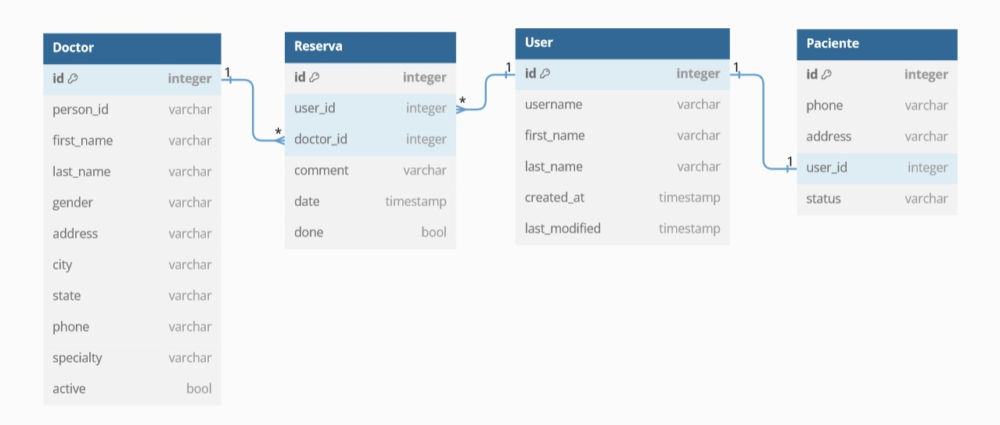

# Sistema de reserva de citas medicas con especialistas

Superusuario: <b>email:</b> admin@admin.com <b>password:</b> superuser99

El <b>superusuario puede agregar mas doctores</b> a la base de datos y hacer <b>reservas</b> de horas medicas con los doctores

Las personas pueden <b>registrarse</b> como <b>pacientes</b> para <b>reservar</b> horas medicas con los doctores

El <b>superusuario</b> puede <b>ver</b> las citas medicas de <b>todos</b> los pacientes, <b>confirmarlas</b> (cita medica terminada) o <b>eliminarlas</b> si lo desea  
En cambio, un <b>paciente registrado</b> solo puede <b>ver</b> solo sus horas medicas y <b>eliminarlas</b> en caso de necesitarlo

Se manejan 4 <b>tablas relacionadas</b> User, Paciente, Doctor, Reserva.

La tabla Paciente es una extension de la tabla User al añadir mas datos de contacto para el usuario registrado La tabla Reserva son las citas medicas donde se incluye un doctor y un usuario

